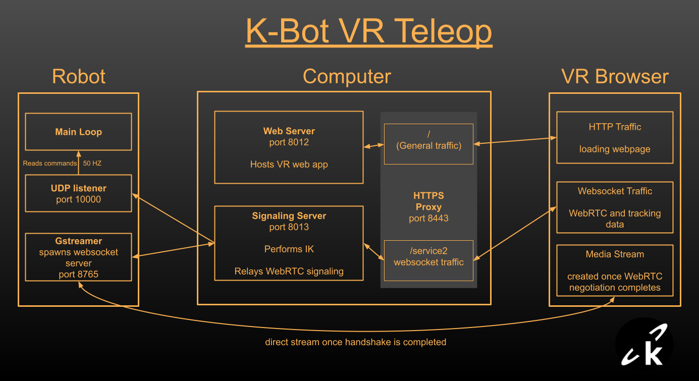

View the complete VR Teleoperation docs at:

- https://docs.kscale.dev/robots/k-bot/teleop/

---

# K-Scale VR Teleoperation (Overview)

Repo Contents:

- frontend: React web app for the VR headset.
- src: Runs on a computer; performs inverse kinematics and relays commands to the robot over UDP.
- kinfer_policies: Latest policies used for teleop.
- rerun: Visualization tools.
  - visualizer.py opens a UDP socket and visualizes commands in Rerun.
  - test_udp_sender.py sends dummy commands.
  - To visualize headset tracking, uncomment the relevant lines in `src/kscale_vr_teleop/command_conn.py` and run both `signaling.py` and `visualizer.py`.

This README is a quick summary; for setup steps, networking notes, and headset workflow, see the docs linked above.
